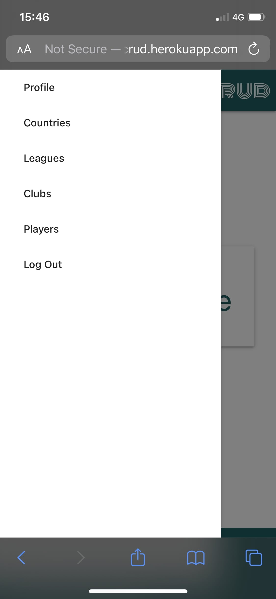
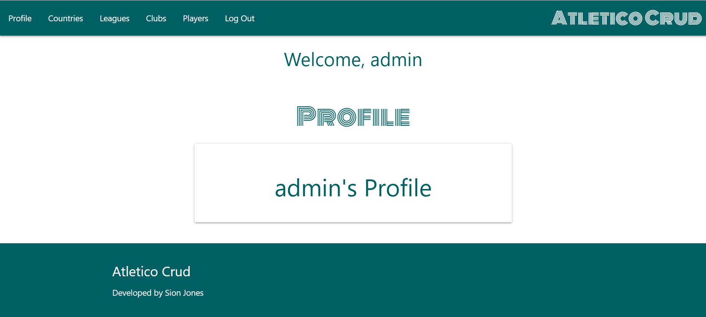
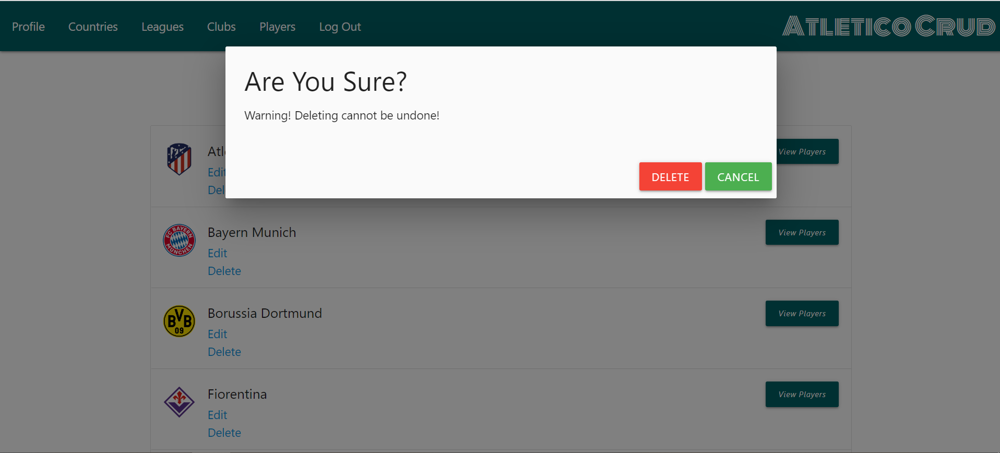

# Atletico Crud


Atletico Crud is an online soccer/football database.

The database contains players who are renowned as having 'legend status' for a particular club, in a particular league within a particular country _e.g. Alan Shearer who played for Newcastle United in the Premier League in England._

The aim of the website is for users to view players who have already been inducted to the database and for them to submit their own suggestions for players to be entered into the database via a Form.

The website's admin will then review the submitted forms and decide whether to create a new entry. The admin has the ability to create/add, read/view, update/edit and delete data.

# User Stories
- As a user, I want to be able to register as a user on the website.
- As a user, I want to be able to log in and log out from the website.
- As a user, I want to be able to read/view countries, leagues, clubs and players that have already been inducted into the database.
- As a user, I want to be able to submit a form to suggest a player that should be added to the database.
- As a user, I want to be able to receive confirmation that my form has been sent.
- As a user, I want to be able to navigate to view all countries, leagues, clubs and players.
- As a user I want to be able to view the website across multiple devices and screen sizes.
- As an admin, I want to be able to create/add data to the database.
- As an admin, I want to be able to read/view data on the database.
- As an admin, I want to be able to updtae/edit data within the database.
- As an admin, I want to be able to delete data from the database.
- As an admin, I want to receive confirmation that actions involving creating, editing or deleting have been successful or unsuccessful.
- As an admin I want to be able to create/add, read/view, update/edit and delete content on the website across multiple devices and screen sizes.

# UX
The aim of the site is to be as minimal as possible so that attention is focused on the database content.

Once registered or logged in, users are taken their profile page. From here, the ever present navigation bar allows the user to navigate to Countries, Leagues, Clubs or Players. When utilising the links in the navbar directly _e.g. clicking Clubs_, the user will be directed to a view showing all clubs across all leagues present in the database. However, if the player were to navigate to _Leagues_ first before selecting _Premier League_, the club's visible would be filitered so that only Premier League clubs are displayed. This gives the user the felxibility to look at what they are most interested in viewing.

Users can also navigate to a _Form_ page to submit their suggestions for players who they believe should be inducted into the database.

The website utilises Materialize CSS to responsively react to different screen sizes so that the user can view content on multiple devices.

## Colour Scheme
I selected the dark-cyan and white colour scheme as they contrasted nicely with each other _e.g. white text on a dark-cyan background or vice versa_. The dark-cyan also didn't clash with any country flag, league logo or club crest/kit and was a more interesting colour than a dark grey or black.

The colour scheme below was generated by [coolors](https://coolors.co/).


## Typography
The font used for the logo and the page headings is Monoton from Google Fonts. I chose this font as it reminded me of the font utilised by the football/soccer magazine 'Mundial'.


# Visual ERD


# Wireframes


# Features

## Existing Features

### Navbar
The navbar is always present at the top of the page for large screens and as a collapsible side navbar on smaller screen devices. The links visible depend on the user session status. For example, if no user is logged in, the only links available are Home, Log In and Register. Similarly, the Form link is only visible when logged in as a non-admin user and is hidden when logged in as an admin. This variation in navbar display is achieved via the code snippet below.


```html
                <ul class="left hide-on-med-and-down">
                    
                        <li><a href="{{ url_for('profile', username=session['user']) }}">Profile</a></li>
                        <li><a href="{{ url_for('countries') }}">Countries</a></li>
                        <li><a href="{{ url_for('leagues', country_id=0) }}">Leagues</a></li>
                        <li><a href="{{ url_for('clubs', league_id=0) }}">Clubs</a></li>
                        <li><a href="{{ url_for('playersa', club_id=0) }}">Players</a></li>
                        
                        <li><a href="{{ url_for('form') }}">Form</a></li>
                        
                        <li><a href="{{ url_for('logout') }}">Log Out</a></li>
                    
                        <li><a href="{{ url_for('home') }}">Home</a></li>
                        <li><a href="{{ url_for('login') }}">Log In</a></li>
                        <li><a href="{{ url_for('register') }}">Register</a></li>
                    
                </ul>
```

### Logo
The logo is always visible at the top of the page for large and small screen devices. The logo will link to the profile page if a user is logged in and will link to the home page if no user is logged in. The code snippet below demonstrates how this is achieved.


```html

                    <a href="{{ url_for('profile', username=session['user']) }}" class="brand-logo right main-title">
                        Atletico Crud
                    </a>
                
                    <a href="{{ url_for('home') }}" class="brand-logo right main-title">Atletico Crud</a>
                
```

### Home Page
The home page allows users visiting the website to Register or to Log-In via clickable buttons.


### Registration
The registration page allows users to create a username and password to gain access to the site. It will not allow for duplicate usernames which is achieved via the code block below.
There is also a link at the bottom of the registration page to take an user to the log-in page in the event that they have already created an account.

```python
@app.route("/register", methods=["GET", "POST"])
def register():
    if request.method == "POST":
        # check if username already exists in db
        existing_user = Users.query.filter(
            Users.user_name == request.form.get("username").lower()).all()

        if existing_user:
            flash("Username already exists")
            return redirect(url_for("register"))

        user = Users(
            user_name=request.form.get("username").lower(),
            password=generate_password_hash(request.form.get("password"))
            )

        db.session.add(user)
        db.session.commit()

        # put the new user into 'session' cookie
        session["user"] = request.form.get("username").lower()
        flash("Registration Successful!")
        return redirect(url_for("profile", username=session["user"]))

    return render_template("register.html")
```

### Log In
The log-in page allows users to log in using their username and password to gain access to the site. It will alert the user if their credentials are incorrect via the code block below.
There is also a link at the bottom of the log-in page to take an user to the registration page in the event that they need to create an account.

```python
@app.route("/login", methods=["GET", "POST"])
def login():
    if request.method == "POST":
        # check if username exists in db
        existing_user = Users.query.filter(
            Users.user_name == request.form.get("username").lower()).all()

        if existing_user:
            print(request.form.get("username"))
            # ensure hashed password matches user input
            if check_password_hash(
                existing_user[0].password, request.form.get("password")):
                    session["user"] = request.form.get("username").lower()
                    flash("Welcome, {}".format(
                        request.form.get("username")))
                    return redirect(url_for(
                        "profile", username=session["user"]))
            else:
                # invalid password match
                flash("Incorrect Username and/or Password")
                return redirect(url_for("login"))

        else:
            # username doesn't exist
            flash("Incorrect Username and/or Password")
            return redirect(url_for("login"))

    return render_template("login.html")
```

### Profile Page
The profile page is what users are directed to once logged-in or registered.

```python
@app.route("/profile/<username>", methods=["GET", "POST"])
def profile(username):

    if "user" in session:
        return render_template("profile.html", username=session["user"])

    return redirect(url_for("login"))
```

### Log Out
The log-out page allows users to log-out of their profile. This is achieved via the code block below.

```python
@app.route("/logout")
def logout():
    # remove user from session cookie
    flash("Log Out Successful!")
    session.pop("user")
    return redirect(url_for("login"))
```

### Flash Messages
Flash messages pop up on the page when users complete actions such as logging in, logging out and entry of incorrect credentials. Additionally, when the user is an admin, the flash messages confirm actions such as successfully adding, editing or deleting data.
These flash messages can be seen in the code snippets above and the format of these messages is set in the file base.html which extends to other pages via template inheritance as shown in the code snippet below.

```html
    <section>
        <!-- flash messages -->
        
        
        
        <div class="row flashes">
            <h4 class="cyan-text text-darken-4 center-align">{{ message }}</h4>
        </div>
        
        
        
    </section>
```

### Countries Page
The countries page displays flags for the countries currently available in the database. When logged in as an admin, the 'Edit' and 'Delete' buttons are visible however these are hidden when logged in as a non-admin user. Clicking on the Country name below the flag image will take the user to the leagues associated with this particular country in the database _e.g. Clicking England will display the English league called Premier League_.

```html
<div class="row">
    
    <div class="col s12 m6 l3 card-style">
        <div class="card">
            <div class="card-image">
                
            </div>
            <div class="card-action">
                <a class="card-text-style" href="{{ url_for('leagues', country_id=country.id ) }}">{{ country.country_name }}</a><br>
                
                <a href="{{ url_for('edit_country', country_id=country.id) }}" class="btn-small green">Edit</a>
                <a href="#modal-{{ country.id }}" class="btn-small red modal-trigger">Delete</a>
                

                <!-- Modal to confirm delete -->
                <div id="modal-{{ country.id }}" class="modal">
                    <div class="modal-content">
                        <h4>Are You Sure?</h4>
                        <p>Warning! Deleting cannot be undone!</p>
                    </div>
                    <div class="modal-footer">
                        <a href="{{ url_for('delete_country', country_id=country.id) }}" class="btn red">Delete</a>
                        <a href="{{ url_for('countries') }}" class="modal-close btn green">Cancel</a>
                    </div>
                </div>

            </div>
        </div>
    </div>
    
</div>
```
```python
class Country(db.Model):
    # schema for the Country model
    id = db.Column(db.Integer, primary_key=True)
    country_name = db.Column(db.String(25), unique=True, nullable=False)
    country_image_url = db.Column(db.String(250), unique=True, nullable=True)
    leagues = db.relationship(
        "League", backref="country", cascade="all, delete", lazy=True)

    def __repr__(self):
        # __repr__ to represent itself in the form of a string
        return
        f"#{self.country_name} - Country Image URL: {self.country_image_url}"
```
```python
# Route for all countries
@app.route("/countries")
def countries():
    countries = list(Country.query.order_by(Country.country_name).all())
    return render_template("countries.html", countries=countries)
```
### Add Country Button (Admin Only)
The Add Country button only appears on the countries page if the user logged in is an admin. Clicking the button takes the admin user to the Add Country page which is discussed below.


```html

<div class="row">
    <div class="col s12 center-align">
        <a href="{{ url_for('add_country') }}" class="btn-large cyan darken-4 white-text">
            Add Country +
        </a>
    </div>
</div>


```

### Add Country Page (Admin Only)
The Add Country page allows the admin user to type in a country name to the form as well as an image url to represent that particular country. The code snippets below show the html form, the routes and the model which PREVENTS DUPLICATE ENTRIES.
```html
<div class="row">
    <form class="col s12" method="POST" action="{{ url_for('add_country') }}">
        <!-- Country Name -->
        <div class="row">
            <div class="input-field col s12">
                <input placeholder="Input Country Name" name="country_name" id="country_name" minlength="3"
                    maxlength="25" type="text" class="validate" required>
                <label for="country_name">Country Name</label>
            </div>
        </div>
        <!-- Country Image URL -->
        <div class="row">
            <div class="input-field col s12">
                <input placeholder="Input Country Image URL" name="country_image_url" id="country_image_url" minlength="3"
                    maxlength="250" type="text" class="validate" required>
                <label for="country_image_url">Country Image URL</label>
            </div>
        </div>
        <!-- Submit Button -->
        <div class="row">
            <div class="col s12 center-align">
                <button type="submit" class="btn-large cyan darken-4">
                    Add Country +
                </button>
            </div>
        </div>
    </form>
</div>
```
PYTHON CODE SNIPPETS FOR ROUTES AND MODELS

### Edit Country Button (Admin Only)
The Edit Country button only appears on the countries page if the user logged in is an admin. Clicking the button takes the admin user to the Edit Country page which is discussed below.

```html

<a href="{{ url_for('edit_country', country_id=country.id) }}" class="btn-small green">Edit</a>
<a href="#modal-{{ country.id }}" class="btn-small red modal-trigger">Delete</a>

```

### Edit Country Page (Admin Only)
The Edit Country page allows the admin user to edit the details for a country such as the country name and the image url to represent that particular country. The code snippets below show the html form, the routes and the model which PREVENTS DUPLICATE ENTRIES.
```html
<div class="row">
    <form class="col s12" method="POST" action="{{ url_for('edit_country', country_id=country.id) }}">
        <!-- Country Name -->
        <div class="row">
            <div class="input-field col s12">
                <input placeholder="Input Country Name" name="country_name" value="{{ country.country_name}}"
                    id="country_name" minlength="3" maxlength="25" type="text" class="validate" required>
                <label for="country_name">Country Name</label>
            </div>
        </div>
        <!-- Country Image URL -->
        <div class="row">
            <div class="input-field col s12">
                <input placeholder="Input Country Image URL" name="country_image_url" value="{{ country.country_image_url}}"
                    id="country_image_url" minlength="3" maxlength="250" type="text" class="validate" required>
                <label for="country_image_url">Country Image URL</label>
            </div>
        </div>
        <!-- Submit Button -->
        <div class="row">
            <div class="col s12 center-align">
                <button type="submit" class="btn-large cyan darken-4">
                    Edit Country +
                </button>
            </div>
        </div>
    </form>
</div>
```
PYTHON CODE SNIPPETS FOR ROUTES AND MODELS

### Delete Country Button (Admin Only)
The Delete Country button only appears on the countries page if the user logged in is an admin. Clicking the button initiates a modal which pops up asking the user if they definitely wish to proceed with the deletion which is discussed in the next section.

```html

<a href="{{ url_for('edit_country', country_id=country.id) }}" class="btn-small green">Edit</a>
<a href="#modal-{{ country.id }}" class="btn-small red modal-trigger">Delete</a>

```

### Delete Country Modal (Admin Only)
The modal pop-up allows a user to confirm the deletion by clicking Delete or to cancel the deletion by clicking Cancel. Clicking Cancel takes the user back to the countries page.

```html
<!-- Modal to confirm delete -->
<div id="modal-{{ country.id }}" class="modal">
    <div class="modal-content">
        <h4>Are You Sure?</h4>
        <p>Warning! Deleting cannot be undone!</p>
    </div>
    <div class="modal-footer">
        <a href="{{ url_for('delete_country', country_id=country.id) }}" class="btn red">Delete</a>
        <a href="{{ url_for('countries') }}" class="modal-close btn green">Cancel</a>
    </div>
</div>
```

### Leagues Page

### Add League Button (Admin Only)

### Add League Page (Admin Only)

### Edit League Button (Admin Only)

### Edit League Page (Admin Only)

### Delete League Button (Admin Only)

### Delete League Modal (Admin Only)

### Clubs Page

### Add Club Button (Admin Only)

### Add Club Page (Admin Only)

### Edit Club Button (Admin Only)

### Edit Club Page (Admin Only)

### Delete Club Button (Admin Only)

### Delete Club Modal (Admin Only)

### Players Page

### Add Player Button (Admin Only)

### Add Player Page (Admin Only)

### Edit Player Button (Admin Only)

### Edit Player Page (Admin Only)

### Delete Player Button (Admin Only)

### Delete Player Modal (Admin Only)

### Form Page

### Confirmation Page

### Footer

### Favicon

## Features Left to Implement

### Improved Admin Functionality
A toggle for username's with admin rights instead of relying on a username.

### Search Functionality
The ability to search for a specific league, club or player.

### Improved Route Mapping
Route for clubs would be country/league/club instead of club/league_id.
Route for players would be country/league/club/player instead of player/club_id.

### Enter Full Record Functionality
A method for a full record to be added whereby a country, league, club and player could be added from one form with data being stored in the relevant tables.

# Technologies Used
- Git - used for version control.
- GitHub - used to secure my code online.
- Gitpod - used as the cloud-based IDE.
- GitHub Projects - used to track project progress [here](https://github.com/sniclasj/atletico-crud/projects/1).
- Flask - used to create the Python web application.
- Flask-SQLAlchemy - used as an extension to Flask to simplify use of SQLAlchemy.
- Flask Migrate - used to handle SQLAlchemy database migrations for the Flask application.
- PyMongo - used as the Python distribution containing tools for working with MongoDB.
- Flask-PyMongo - used to bridge Flask and PyMongo.
- SQLAlchemy - used for the relational database provider.
- MongoDB - used as the non-relational database provider.
- Heroku - used to deploy the site.
- amiresponsive - used for the mockup image.
- Materialize CSS - used to create the layout and structure of the website.
- HTML - used to write the code for the website.
- Python - used to write the code for the website.
- JavaScript - used to initialize Materialize CSS scripts.
- CSS - used to style the website.

# Testing
To view all testing documentation, please refer to [TESTING.md](TESTING.md).

# Deployment
## Heroku


# Set Up

## Initial Set Up SQLAlchemy


## Flask-Migrate


## Initial Set Up MongoDB


# Credits

## Content
I utilised the Mini Project on the [Code Institute LMS](https://learn.codeinstitute.net/courses/course-v1:CodeInstitute+DCP101+2017_T3/courseware/9e2f12f5584e48acb3c29e9b0d7cc4fe/054c3813e82e4195b5a4d8cd8a99ebaa/) to help me create this project.

## Media
The images used for country flags, league logos, club badges and players are summarised in the table below.

| Country  | League | Club | Player |
| ------------- | ------------- | ------------ | ------------- |
| [England](https://upload.wikimedia.org/wikipedia/en/thumb/b/be/Flag_of_England.svg/1280px-Flag_of_England.svg.png)  | [Premier League](https://upload.wikimedia.org/wikipedia/en/thumb/f/f2/Premier_League_Logo.svg/1920px-Premier_League_Logo.svg.png)  | [Newcastle](https://upload.wikimedia.org/wikipedia/en/thumb/5/56/Newcastle_United_Logo.svg/800px-Newcastle_United_Logo.svg.png) | [Alan Shearer](https://resources.premierleague.com/premierleague/photos/players/250x250/p1.png)  |
|          |                 |           | [Gary Speed](https://resources.premierleague.com/premierleague/photos/players/250x250/p1849.png)   |
|          |                 | [Liverpool](https://upload.wikimedia.org/wikipedia/en/thumb/0/0c/Liverpool_FC.svg/800px-Liverpool_FC.svg.png) | [Mohamed Salah](https://www.planetsport.com/image-library/square/500/r/rszpa-56244351.jpg) |
|          |                 |           | [Kenny Dalglish](https://static.independent.co.uk/2021/03/04/09/newFile-2.jpg?quality=75&width=990&auto=webp&crop=982:726,smart)  |
| [Germany](https://upload.wikimedia.org/wikipedia/en/thumb/b/ba/Flag_of_Germany.svg/1280px-Flag_of_Germany.svg.png)  | [Bundesliga](https://upload.wikimedia.org/wikipedia/en/thumb/d/df/Bundesliga_logo_%282017%29.svg/800px-Bundesliga_logo_%282017%29.svg.png)  | [Borussia Dortmund](https://upload.wikimedia.org/wikipedia/commons/thumb/6/67/Borussia_Dortmund_logo.svg/800px-Borussia_Dortmund_logo.svg.png) | [Robert Lewandowski](https://e0.365dm.com/14/01/2048x1152/452132615_3061784.jpg?20140104223905)  |
|          |                 |           | [Erling Haaland](https://assets.goal.com/v3/assets/bltcc7a7ffd2fbf71f5/blt49694380611d8437/627fb6ef9154c30583900874/GettyImages-1397198517.jpg?quality=80&width=1000&format=pjpg&auto=webp)    |
|          |                 | [Werder Bremen](https://upload.wikimedia.org/wikipedia/commons/thumb/b/be/SV-Werder-Bremen-Logo.svg/800px-SV-Werder-Bremen-Logo.svg.png) | [Claudio Pizarro](https://static.dw.com/image/19096488_303.jpg) |
|          |                 |           | [Miroslav Klose](https://pbs.twimg.com/media/D1OQozYXQAA6RNS?format=jpg&name=medium)  |
| [Spain](https://upload.wikimedia.org/wikipedia/commons/thumb/8/89/Bandera_de_Espa%C3%B1a.svg/1280px-Bandera_de_Espa%C3%B1a.svg.png)  | [La Liga](https://upload.wikimedia.org/wikipedia/commons/thumb/b/bb/LaLiga_Santander_logo_%28stacked%29.svg/1024px-LaLiga_Santander_logo_%28stacked%29.svg.png)  | [Atletico Madrid](https://upload.wikimedia.org/wikipedia/en/thumb/f/f4/Atletico_Madrid_2017_logo.svg/800px-Atletico_Madrid_2017_logo.svg.png) | [Antoine Griezmann](https://cdn.resfu.com/media/img_news/agencia-efe_multimedia_55007494820.multimedia.photos.55007494820003.file.jpg?size=1000x&lossy=1)  |
|          |                 |           | [Fernando Torres](https://img-estaticos.atleticodemadrid.com/system/file4s/14522/medium2x2/torrescapitan.jpg?1419808980)   |
|          |                 | [Real Betis](https://upload.wikimedia.org/wikipedia/en/thumb/1/13/Real_betis_logo.svg/1024px-Real_betis_logo.svg.png) | [Joaquín](https://i.guim.co.uk/img/media/d475c2cb1f3d4c2c8803e858e115490aa6facb43/0_136_4000_2400/master/4000.jpg?width=1140&quality=45&fit=max&dpr=2&s=51f92cfa52d77728404265527d9cc00f) |
|          |                 |           | [Denílson](https://images.squarespace-cdn.com/content/v1/5b1ee719af2096cdf978a8be/1601496483372-4NP6JH3SCPY926YX2QCJ/image-asset.jpeg?format=750w)  |
| [Italy](https://upload.wikimedia.org/wikipedia/en/thumb/0/03/Flag_of_Italy.svg/1024px-Flag_of_Italy.svg.png)  | [Serie A](https://upload.wikimedia.org/wikipedia/en/thumb/c/c5/Logo_Serie_A_TIM_2021.svg/800px-Logo_Serie_A_TIM_2021.svg.png)  | [Fiorentina](https://upload.wikimedia.org/wikipedia/commons/thumb/f/f2/2022_ACF_Fiorentina_logo.svg/800px-2022_ACF_Fiorentina_logo.svg.png) | [Gabriel Batistuta](https://cdn.vox-cdn.com/thumbor/l4ZmfjSrScIl7cnGYMxvQAs3U40=/1400x1400/filters:format(jpeg)/cdn.vox-cdn.com/uploads/chorus_asset/file/22002200/1638835.jpg)  |
|          |                 |           | [Dušan Vlahovic](https://www.si.com/.image/t_share/MTgwNjQ1MzM2MzU4ODU1NzY4/sipa_33122839.jpg)    |
|          |                 | [Roma](https://upload.wikimedia.org/wikipedia/en/thumb/f/f7/AS_Roma_logo_%282017%29.svg/800px-AS_Roma_logo_%282017%29.svg.png) | [Daniele De Rossi](https://cdn.vox-cdn.com/thumbor/bJHTKnBFR3Y1-gDrv2Ypoguc1XA=/0x0:3000x2140/1220x813/filters:focal(1230x551:1710x1031):format(webp)/cdn.vox-cdn.com/uploads/chorus_image/image/59412171/944411452.jpg.0.jpg) |
|          |                 |           | [Francesco Totti](https://e1.365dm.com/13/02/800x600/Francesco-Totti-Roma-2013_2902020.jpg?20130717231903)  |
## Acknowledgements
I would like to thank my Code Institute mentor Tim Nelson for his support during the course of this project.

I would also like to thank the Code Institute tutor team for the assistance provided during the course of this project.