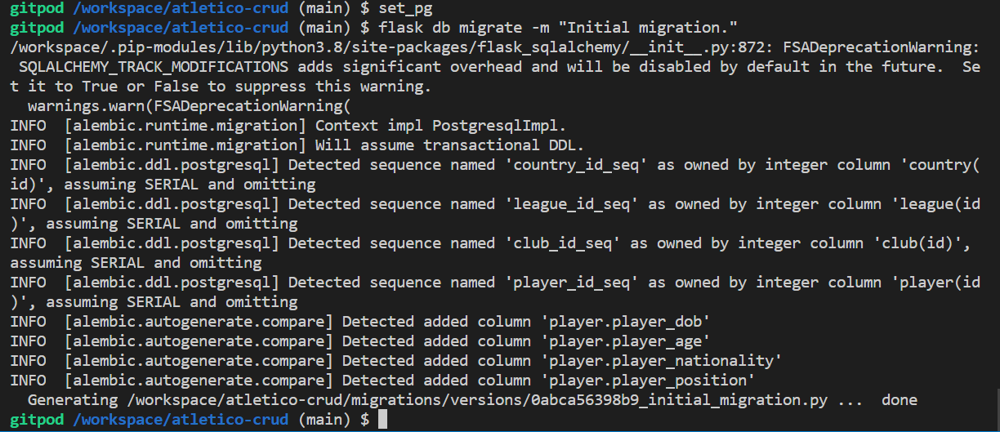

# Atletico Crud
Atletico Crud is an online soccer/football database.
The database contains players who are renowned as having 'legend status' for a particular club, in a particular league within a particular country _e.g. Alan Shearer who played for Newcastle United in the Premier League in England._
The aim of the website is for users to view players who have already been inducted to the database and for them to submit their own suggestions for players to be entered into the database via a Form.
The website's admin will then review the submitted forms and decide whether to create a new entry.

# User Stories
- As a user, I want to be able to register as a user on the website.
- As a user, I want to be able to log in and log out from the website.
- As a user, I want to be able to read/view countries, leagues, clubs and players that have already been inducted into the database.
- As a user, I want to be able to submit a form to suggest a player that should be added to the database.
- As a user, I want to be able to receive confirmation that my form has been sent.
- As a user, I want to be able to navigate to view all countries, leagues, clubs and players.

- As an admin, I want to be able to create/add data to the database.
- As an admin, I want to be able to read/view data on the database.
- As an admin, I want to be able to updtae/edit data within the database.
- As an admin, I want to be able to delete data from the database.
- As an admin, I want to receive confirmation that actions involving creating, editing or deleting have been successful or unsuccessful.

# UX

# Colour Scheme

# Typography

# Visual ERD

# Wireframes

# Features

## Existing Features

## Features Left to Implement

# Technologies Used

# Testing

# Deployment

# Set Up Steps

# Initial Set Up SQLAlchemy

# Flask-Migrate

# Initial Set Up MongoDB

# Heroku Deployment

# Credits
