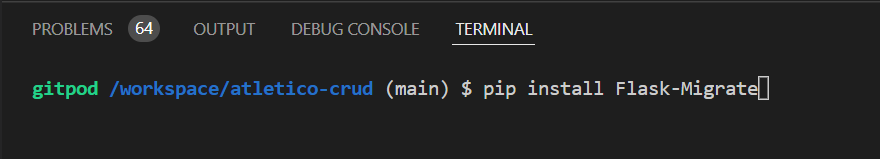

# Set Up

## Initial Set Up SQLAlchemy

- Install Flask-SQLAlchemy

- Confirmation of SQLAlchemy Installation

- Creation of env.py File

- Add env.py and pychache to gitignore

- Import os to env.py

- Create atleticocrud Folder with init.py File

- Add Imports to init.py File

- Set Variables in init.py

- Create routes.py File

- Add Imports to routes.py

- Create app.py File

- Add Imports to app.py

- Create Templates Folder with base.html File

- Set Up base.html Boilerplate

- Initial App Run in Development Environment

- Create models.py File

- Create Database Postgres From CLI

- Generate and Migrate Models

## Flask-Migrate

During the course of development, it became necessary to update the Postgres models. In order to do this, Flask-Migrate was used.

- Install Flask-Migrate

- Flask-Migrate Install Confirmed

- Import Flask-Migrate to init.py

- Define Migrate in init.py

- Enter Flask DB Init Command to CLI

- Carry Out Initial Migration in CLI

- Carry Out DB Upgrade in CLI

## Initial Set Up MongoDB

- Connect MongoDB

- Confirmation of MongoDB Connection

- Install DNS Python

- Install PyMongo

- Install Flask-PyMongo

- Get MONGO_URI

Click on the cluster created for the project.

Click on the _Connect_ button.

Click _Connect Your Application_.

Copy the connection string and ensure to replace `<password>` with your own password.

Paste this string into the env.py file and Heroku config var as the value for the MONGO_URI key.

- Add Mongo URI to env.py.

