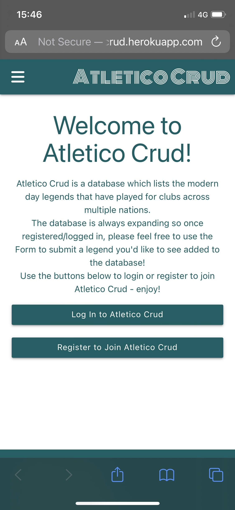
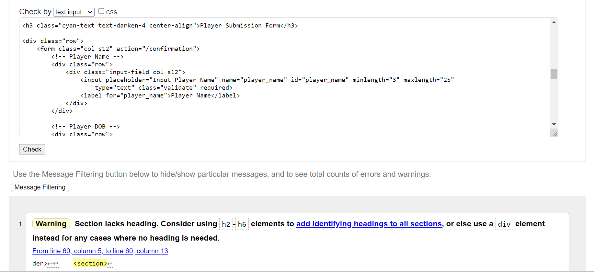
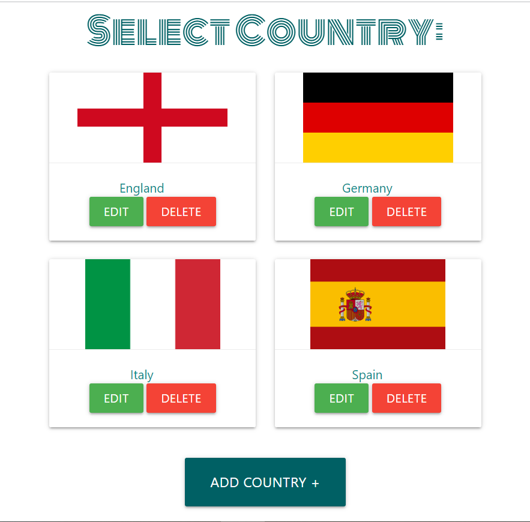

# Testing

# Browser Compatibility

## Chrome

Chrome Navbar

Chrome Home Page

Chrome Register Page

Chrome Log-In Page

Chrome Profile Page

Chrome Countries Page

Chrome Leagues Page

Chrome Clubs Page

Chrome Players Page

Chrome Addition of Country/Leage/Club/Player

Chrome Edit Country/League/Club/Player Page

Chrome Delete Modal

Chrome Log-Out

## Edge

## Safari (Mobile)

Safari Home Page

Safari Register Page

Safari Sidenav Page

Safari Log-In Page

Safari Profile Page

Safari Countries Page

Safari Leagues Page

Safari Clubs Page

Safari Players Page

Safari Edit Player Page

Safari Delete Modal

Safari Log-Out

# Code Validation

## HTML

The following screenshots and hyperlinks show that the same warning is raised for all pages. The warning is due to the lack of heading on a section element relating to flash messages. This is due to the extension of base.html to all other html pages via template inheritance. Giving the section a heading is not appropriate in this instance.

[Home Page](https://validator.w3.org/nu/?showsource=yes&doc=https%3A%2F%2Fatletico-crud.herokuapp.com%2F)

[Register Page](https://validator.w3.org/nu/?showsource=yes&doc=https%3A%2F%2Fatletico-crud.herokuapp.com%2Fregister)

[Log In Page](https://validator.w3.org/nu/?showsource=yes&doc=https%3A%2F%2Fatletico-crud.herokuapp.com%2Flogin)

[Profile Page](https://validator.w3.org/nu/?showsource=yes&doc=https%3A%2F%2Fatletico-crud.herokuapp.com%2Fprofile%2Fadmin)

[Countries Page](https://validator.w3.org/nu/?showsource=yes&doc=https%3A%2F%2Fatletico-crud.herokuapp.com%2Fcountries)

[Leagues Page](https://validator.w3.org/nu/?showsource=yes&doc=https%3A%2F%2Fatletico-crud.herokuapp.com%2Fleagues%2F0)

[Clubs Page](https://validator.w3.org/nu/?showsource=yes&doc=https%3A%2F%2Fatletico-crud.herokuapp.com%2Fclubs%2F0)

[Players Page](https://validator.w3.org/nu/?showsource=yes&doc=https%3A%2F%2Fatletico-crud.herokuapp.com%2Fplayersa%2F0)

The following pages can be validated by visiting the respective page, right clicking on the page and selecting _View page source_. The source code can then be copied and pasted into the HTML validator providing the option of _Check by text input_ has been selected on the validator page. For this reason, no hyperlinks have been provided however the following screenshots show that the same warning is raised for all pages. The warning is due to the lack of heading on a section element relating to flash messages. This is due to the extension of base.html to all other html pages via template inheritance. Giving the section a heading is not appropriate in this instance.

Add Country Page

Add League Page

Add Club Page

Add Player Page

Edit Country Page

Edit League Page

Edit Club Page

Edit Player Page

Form Page

Confirmation Page

## CSS

The hyperlink and screenshot below shows that the only error displaying when validating the CSS is related to the link used to import Materialize CSS. As this code is essential for the app's style and is also not code that I have written, this error is ignored.

[CSS Validation](https://jigsaw.w3.org/css-validator/validator?uri=https%3A%2F%2Fatletico-crud.herokuapp.com%2F&profile=css3svg&usermedium=all&warning=1&vextwarning=&lang=en)

## JavaScript

The screenshot below shows that the only issue with the JavaScript used for this project is an undefined variable _M_. This arises due to the initialization JavaScrip code used by Materialize CSS and can therefore be ignored.

## Python

The following screenshots show that [pep8 online](http://pep8online.com/) found no errors in the python code for init.py, models.py, routes.py and app.py.

The files env.py and any python files in the _mirations_ folder were not validated as this is not required.

Init

Models

Routes

App

# Responsiveness

## Countries

### Countries Large

### Countries Medium

### Countries Small

## Leagues Page

### Leagues Large

### Leagues Medium

### Leagues Small

## Clubs Page

### Clubs 

### Clubs Medium and Below

## Players Page

# User Story Tests

- As a user, I want to be able to register as a user on the website.

- As a user, I want to be able to log in and log out from the website.

- As a user, I want to be able to read/view countries, leagues, clubs and players that have already been inducted into the database.

- As a user, I want to be able to submit a form to suggest a player that should be added to the database.

- As a user, I want to be able to receive confirmation that my form has been sent.

- As a user, I want to be able to navigate to view all countries, leagues, clubs and players from the navbar.

- As a user I want to be able to view the website across multiple devices and screen sizes.

- As an admin, I want to be able to create/add data to the database.

- As an admin, I want to be able to read/view data on the database.

- As an admin, I want to be able to updtae/edit data within the database.

- As an admin, I want to be able to delete data from the database.

- As an admin, I want to receive confirmation that actions involving creating, editing or deleting have been successful or unsuccessful.

- As an admin I want to be able to create/add, read/view, update/edit and delete content on the website across multiple devices and screen sizes.

# Unfixed Bugs