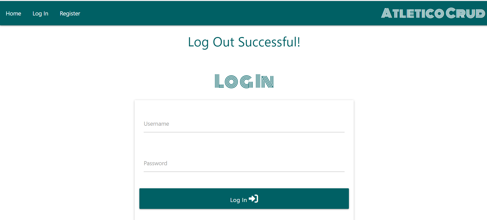

# Testing

# Browser Compatibility

## Chrome
Chrome Home Page

Chrome Register Page

Chrome Log-In Page

Chrome Profile Page

Chrome Countries Page

Chrome Leagues Page

Chrome Clubs Page

Chrome Players Page

Chrome Edit Club Page

Chrome Delete Modal

Chrome Log-Out

## Edge

## Safari (Mobile)
Safari Home Page

Safari Register Page

Safari Sidenav Page

Safari Log-In Page

Safari Profile Page

Safari Countries Page

Safari Leagues Page

Safari Clubs Page

Safari Players Page

Safari Edit Player Page

Safari Delete Modal

Safari Log-Out

# Code Validation

## HTML

## CSS

## JavaScript

## Python

# Responsiveness

# User Story Tests
- As a user, I want to be able to register as a user on the website.
- As a user, I want to be able to log in and log out from the website.
- As a user, I want to be able to read/view countries, leagues, clubs and players that have already been inducted into the database.
- As a user, I want to be able to submit a form to suggest a player that should be added to the database.
- As a user, I want to be able to receive confirmation that my form has been sent.
- As a user, I want to be able to navigate to view all countries, leagues, clubs and players.
- As a user I want to be able to view the website across multiple devices and screen sizes.
- As an admin, I want to be able to create/add data to the database.
- As an admin, I want to be able to read/view data on the database.
- As an admin, I want to be able to updtae/edit data within the database.
- As an admin, I want to be able to delete data from the database.
- As an admin, I want to receive confirmation that actions involving creating, editing or deleting have been successful or unsuccessful.
- As an admin I want to be able to create/add, read/view, update/edit and delete content on the website across multiple devices and screen sizes.

# Unfixed Bugs